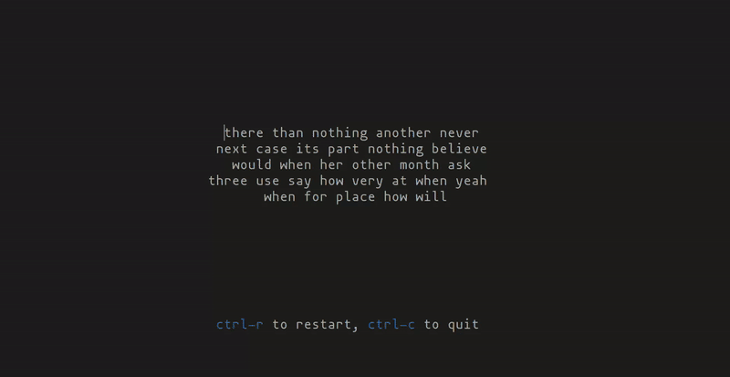

# toipe

A trusty terminal typing tester for the tux.



# Usage

## Install

```
cargo install toipe
```

## Run typing test

toipe looks best on a nice terminal (such as Alacritty) with color and style support.

```
toipe
```

## Use a different word list

By default (in versions `>0.1.1`), a list of top 250 English words is used and random words are selected from it.

To use the OS provided word list instead (default in versions `<=0.1.1`), use:
```
toipe -w os
```
Note: the OS word list varies a lot from system to system and usually has more than 100,000 words. This can lead to difficult and esoteric words appearing in the test, reducing your typing speed.

You can provide your own word list too (TODO: requirements and assumptions of wordlist):
```
toipe -w /path/to/word/list
```

# License

MIT
